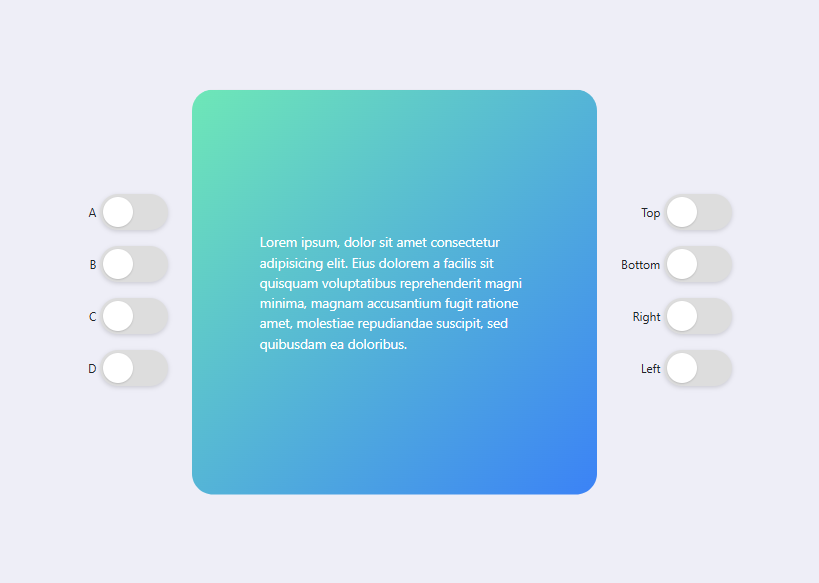
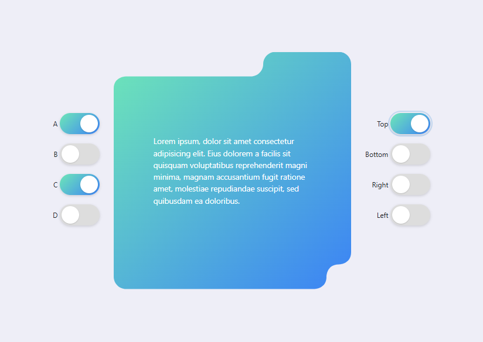
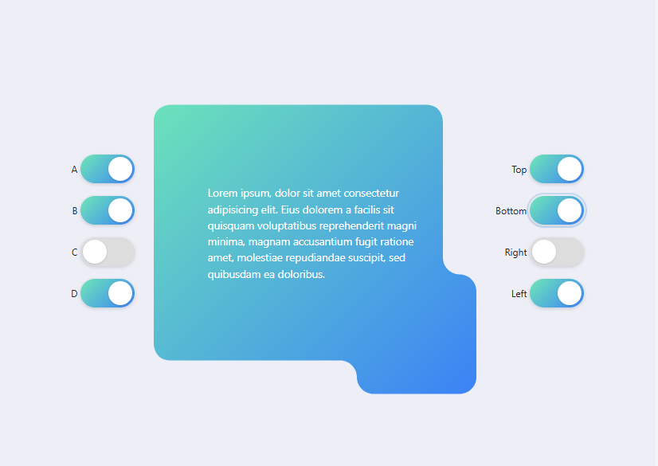
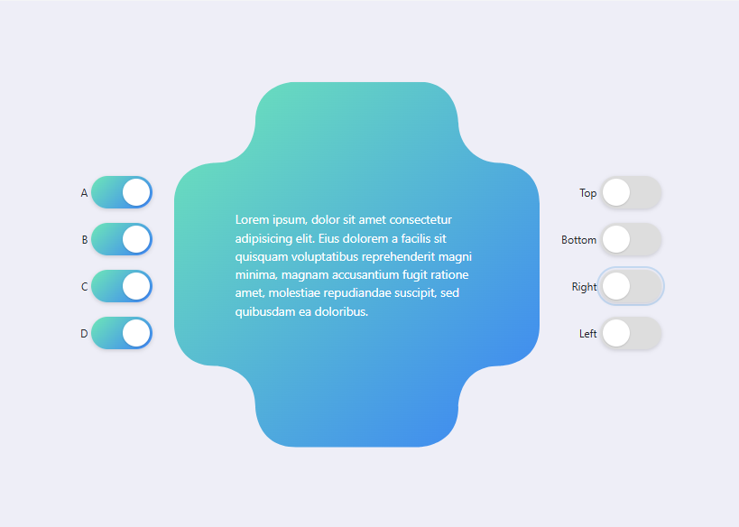

# ClipPathLogic

**Projeto:** ClipPathLogic  
**Autor:** Jhonatan | Nathan  
**GitHub:** [https://github.com/Ntzzn-Dev](https://github.com/Ntzzn-Dev)  
**Data:** 26/09/2025  


 

## Descrição  

Este projeto é uma aplicação web experimental que utiliza **`clip-path` com curvas Bézier cúbicas** para criar divs com bordas arredondadas e entalhes personalizados em qualquer lado do container.  
A ideia é explorar efeitos visuais criativos e responsivos sem depender de imagens externas, apenas com **HTML, CSS e JavaScript**.

## Principais funcionalidades:

- Geração dinâmica de paths em SVG convertidos para `clip-path`.  
- Borda arredondada em todos os cantos utilizando curvas Bézier.  
- Possibilidade de adicionar vãos em `top` `right` `bottom` `left`.  
- Possibilidade de adicionar vãos em `TopRight` `BottomRight` `BottomLeft`.  
- Efeitos visuais totalmente personalizáveis via switchs de controle em tempo real.  
- Renderização em tempo real assim que a página é carregada.  

## Demonstração  

### Tela Principal  
No início, a div vem arredondada nas pontas apenas.  
<p float="left">

</p>

### Dents
Ao ativar um lado da div, um dent é formado.  
<p float="left">
 
</p>

### Corners
Ao ativar uma das letras, um canto é cortado.  
Sendo:
| Valor | Correspondencia |
|:-:|:-:|
|A| Top Left |
|B| Top Right|
|C| Bottom Right|
|D| Bottom Left|
<p float="left">

</p>

### Radius  
Ao clicar na div, seu raio alterna entre 27 e 60
<p float="left">

</p>

## Utilização  
1. Defina a div com o nome RoundDiv (conteudo não necessário):  
```html
<div id="roundedDiv">
    <div class="conteudo">
        Lorem ipsum, dolor sit amet consectetur adipisicing elit. 
        Eius dolorem a facilis sit quisquam voluptatibus reprehenderit 
        magni minima, magnam accusantium fugit ratione amet, molestiae 
        repudiandae suscipit, sed quibusdam ea doloribus.
    </div>
</div>
```

2. Coloque o css certo nela:
```
#roundedDiv{    
    width: 30em;
    height: 30em;
    background: linear-gradient(135deg,#6ee7b7 0%,#3b82f6 100%);
    display:flex;
    align-items:center;
    justify-content:center;
    color:white;
    font-family:system-ui,Segoe UI,Roboto,"Helvetica Neue",Arial;
    font-size:18px;
    box-shadow:0 10px 30px rgba(0,0,0,0.12);
    border-radius:24px;
    -webkit-transition:clip-path .25s ease;transition:clip-path .25s ease;
}
```

3. Coloque roundClip.js na sua pasta e importe no seu projeto:  
```
    <script src="roundClip.js"></script>
    <script src="script.js"></script>
```  

4. No seu script principal você pode definir inicialmente para que a div ja comece alterada:

```
document.addEventListener('DOMContentLoaded', ()=>{
  const box = document.getElementById('roundedDiv');
  let target = 28;
  let withTRBL = [false, true, false, false]
  let conersABCD = [false, false, true, true]
  let dentSize = 2;
  applyRoundedClip(box, target, withTRBL, conersABCD, dentSize);
})
```

5. [!Opcional] Definir para que a div mude de raio quando clicada:
```
box.addEventListener('click', ()=>{
    target = target == 28 ? 60 : 28;
    applyRoundedClip(box, target, withTRBL, conersABCD, dentSize);
});
```  
  
# **Observação :** 
Você consegue alterar a forma da div chamando essa função mudando seus valores:
```
applyRoundedClip(
  elemento,         // Elemento alvo (ex: document.getElementById("roundedDiv"))
  raio,             // Raio de arredondamento da div
  bordas,           // Quais bordas serão arredondadas [CIMA, DIREITA, BAIXO, ESQUERDA]
  cantos,           // Quais cantos serão arredondados [SUPESQUERDO, SUPDIREITO, INFDIREITO, INFESQUERDO]
  dentSize          // Tamanho do "dent" (entalhe) aplicado na div
);
```
**Ex:**
```
applyRoundedClip(
  document.getElementById("roundedDiv"),
  30,
  [true, true, true, true],
  [true, false, true, false],
  20
);
```

Veja o changelog completo em [CHANGELOG.md](CHANGELOG.md)